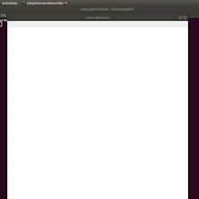

# RRT

## Introduction
The rapidly exploring random tree is an algorithm used to sample multi-dimensional problem spaces efficiently and quickly. The algorithm can be described as a space-filling tree that will randomly sample a constrained configuration space and is inherently biased to expand into unsampled regions. 

This RRT is implemented on a 2 dimensional cartesian plane to be used as a path finding algorithm. The Obstacles are depicted as black circles and the start and end areas are marked by red circles. 

<p align="center">
  
</p>
<p align="center">
    Fig: black - obstacles, red - start and end zones, green - sampled paths
</p>

## Dependencies
- Python3
- OpenCV python library
- Octave

## Downloading abd Running the Code
- Clone the RRT repository to your local machine
    ```
    git clone https://github.com/arthurgomes4/RRT.git
    ```
- From the RRT directory run:
    ```
    python3 RRT.py
    ```
- Double click with mouse cursor to mark obstacles.
- Press Esc to move to next step
- Double click with mouse cursor to mark start and end
- Press Esc to move to next step
- Press Esc to exit program

<p align="center">
  
</p>
<p align="center">
    Fig: Using the GUI
</p>

[](https://code.visualstudio.com/)
[](https://github.com/arthurgomes4)
